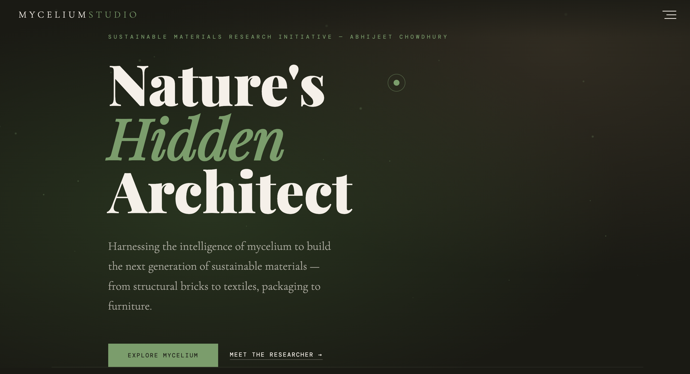
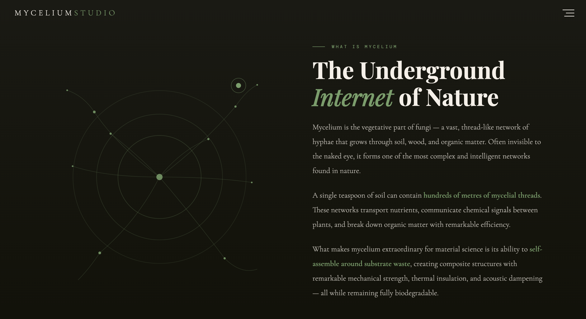
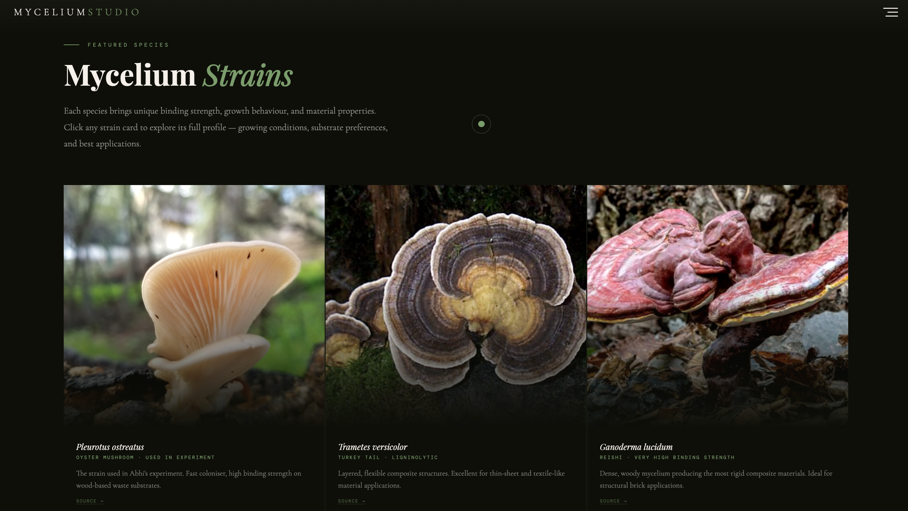
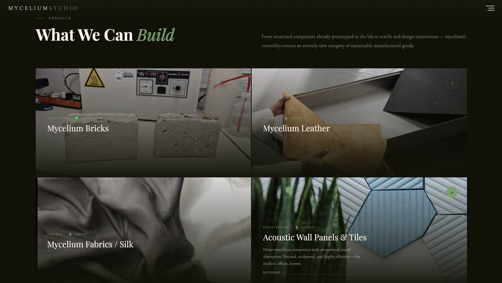
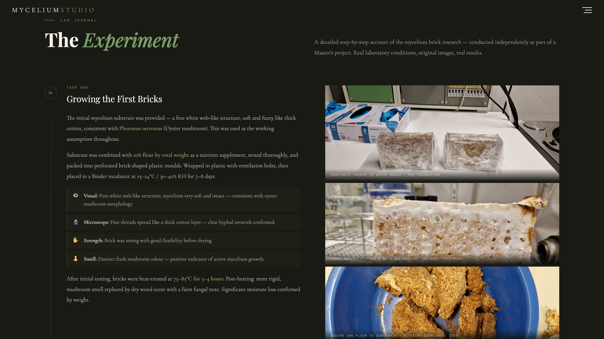
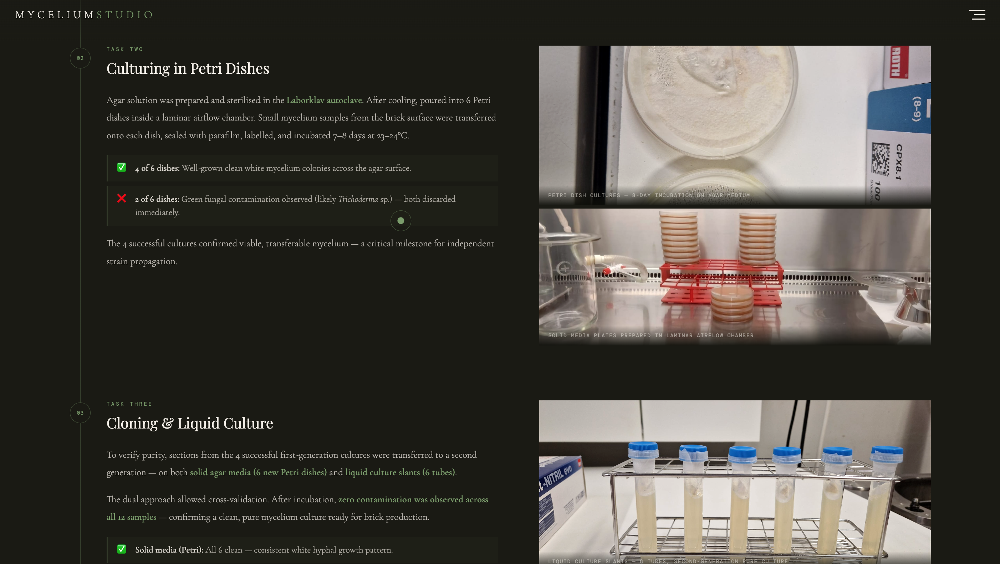
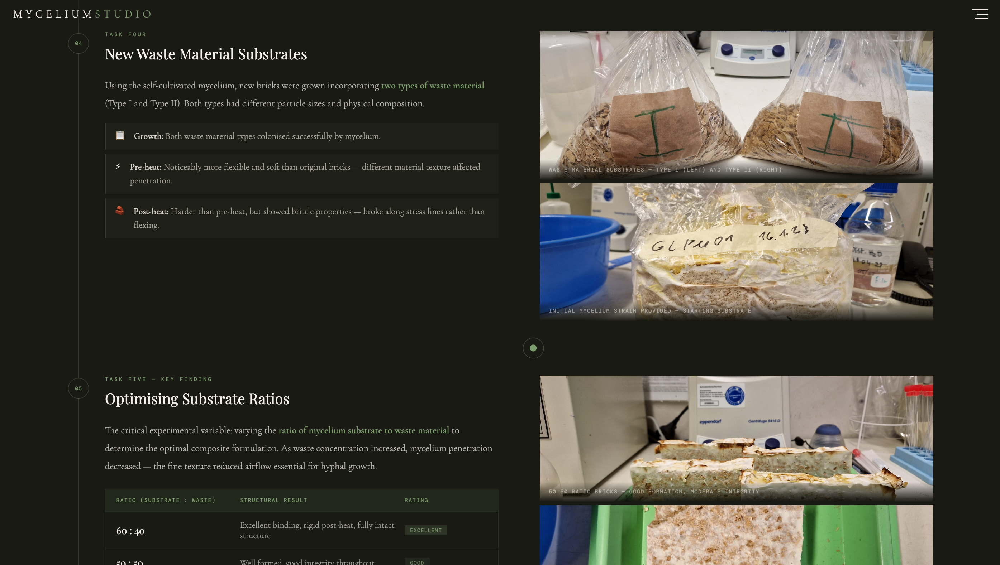
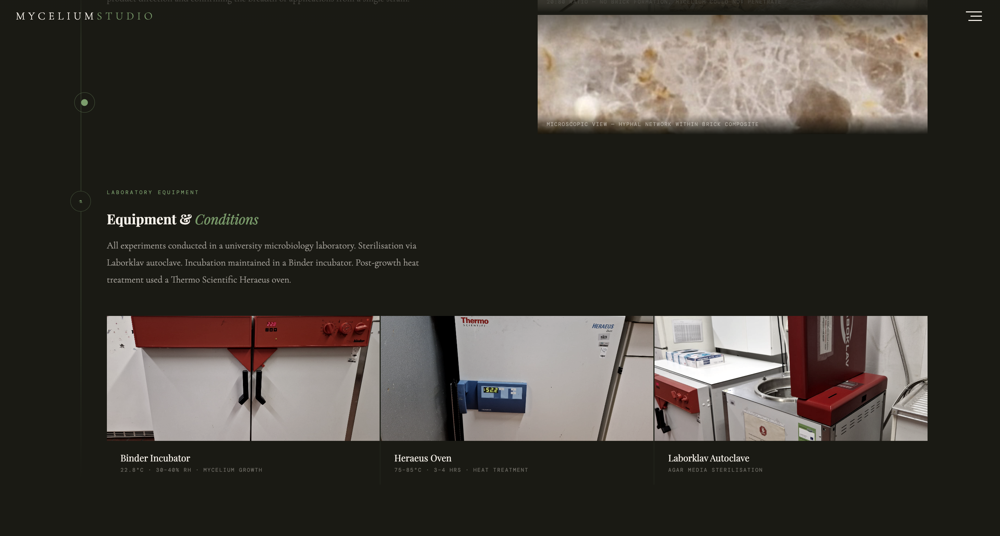
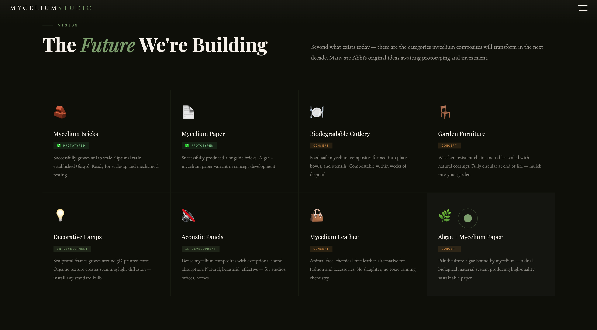
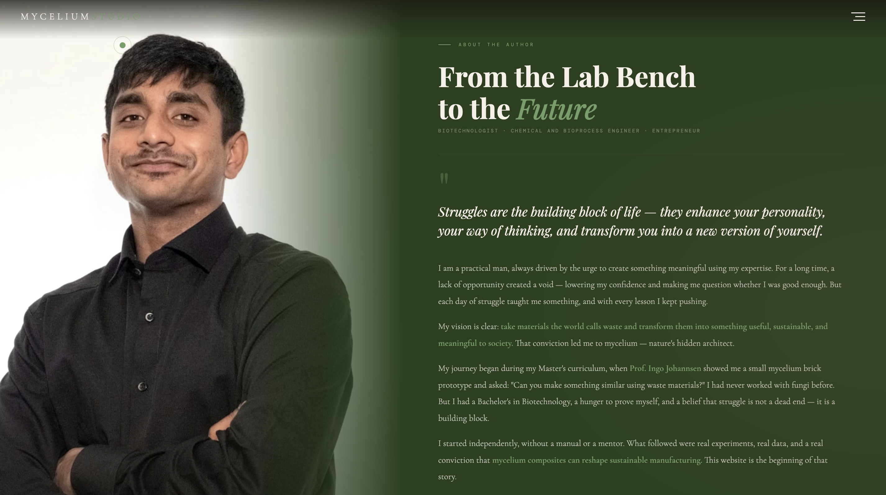

# Mycelium Studio — The Future Is Fungal

A sustainable materials research initiative by **Abhijeet Chowdhury** exploring the potential of mycelium composites to revolutionize manufacturing and packaging.

---

## 🍄 About the Website

**Mycelium Studio** is a professional portfolio and research showcase dedicated to sustainable material science. The website presents a comprehensive research journey into mycelium-based composites — from initial experiments to commercial product applications.

### Core Vision
> **"Take materials the world calls waste and convert them into something useful, sustainable, and meaningful to society."**

This website documents the research, findings, and future vision for turning mycelium (the vegetative network of fungi) into the next generation of sustainable, biodegradable materials.

---

## 📸 Website Showcase

### Hero Section — First Impression

*The striking hero section introduces Mycelium Studio with bold typography and atmospheric design.*

*Dynamic visual elements guide visitors through the sustainable materials research initiative.*

---

## 🔬 Mycelium Strains — The Science

### Featured Species Overview

*Detailed breakdown of four key mycelium species used in composite research:*
- **Ganoderma lucidum** (Reishi) — Extreme binding strength for structural composites
- **Pleurotus ostreatus** (Oyster) — Fast-growing workhorse for packaging and textiles
- **Trametes versicolor** (Turkey Tail) — Flexible composites for thin-sheet applications
- **Hericium erinaceus** (Lion's Mane) — Dense networks for acoustic panels and decor

---

## 🏗️ What We Can Build — Products

### Product Categories

*Six major product categories showcasing mycelium versatility:*

1. **Mycelium Bricks** — Load-bearing, fire-resistant, fully compostable structural elements
2. **Mycelium Leather** — Soft, breathable, animal-free leather alternative
3. **Transport & Packaging** — Shock-absorbing material replacing styrofoam
4. **Decorative Items** — Lampshades, wall panels, and organic sculptures
5. **Textiles & Threads** — Natural fibers with antimicrobial properties
6. **Acoustic Panels** — Dense composites with exceptional sound dampening

---

## 🧪 The Lab Journal — Experimental Process

### Task 1: Growing Initial Mycelium Bricks

*First-generation brick cultivation showing mycelium colonization under laboratory conditions.*

**Conditions Used:**
- Temperature: 23–24°C
- Humidity: 30–40% RH
- Duration: 7–8 days
- Substrate: Agricultural waste + 10% flour supplement

---

### Task 2: Culturing in Petri Dishes

*Pure culture establishment — transferring mycelium samples to agar plates for verification.*

**Results:**
- ✅ 4 of 6 dishes: Pure white mycelium colonies
- ⚠️ 2 of 6 dishes: Contamination (Trichoderma species detected and discarded)

---

### Task 3 & 4: Cloning & Optimization

*Second-generation culture cloning and substrate-to-waste ratio optimization.*

**Ratios Tested:**
- 50:50, 60:40, 40:60, 20:80 (Substrate:Waste)
- Visual and microscopic verification of purity
- Strength and binding efficacy analysis

---

### Task 5: Heat Treatment & Finalization

*Final heat treatment (75–85°C, 3–4 hours) to halt growth and consolidate brick structure.*

**Post-Treatment Results:**
- ✓ More rigid structure with strong hyphal network binding
- ✓ Significant moisture loss (weight reduction recorded)
- ✓ Preserved compressive strength and flexibility

---

## 🚀 The Future We're Building

### Vision for Next Decade

*Emerging applications under research and development:*

**Concepts:**
- 🍽️ Biodegradable cutlery and food-safe plates
- 🪑 Weather-resistant garden furniture
- 💡 Sculptural lamp structures with integrated lighting

**In Development:**
- 🛋️ Interior design elements with natural aesthetics
- 🎵 Professional-grade acoustic treatment systems
- 📦 Custom-molded protective packaging solutions

---

## 👨‍🔬 About the Researcher

### Abhijeet Chowdhury
**Biotechnologist · Chemical & Bioprocess Engineer · Founder**

### Journey & Background

**Education:**
- BSc Biotechnology
- MSc Materials Research (Germany)
- Research conducted under Prof. Ingo Johannsen

**The Turning Point:**
During Master's curriculum, Prof. Johannsen posed a challenge: *"Can you make something similar using waste materials?"* Armed with a Bachelor's in Biotechnology but no prior fungi experience, Abhijeet:

✓ Independently researched mycelium cultivation procedures  
✓ Successfully grew mycelium bricks using waste substrates  
✓ Optimized substrate-to-waste ratios for material strength  
✓ Cultivated pure cultures in laboratory conditions  
✓ Conducted microscopic verification (DNA extraction pending due to timeline)  

**Core Belief:**
> "Struggles are the building block of life. They enhance your personality, your way of thinking, and transform you into a new version of yourself."

**Expertise:**
- Mycelium Composites Research
- Sustainable Materials Development
- Waste Valorisation & Circular Economy
- Startup Entrepreneurship
- Laboratory Cultivation & Analysis

---

## 🌱 Key Technologies & Materials

### Substrate Types Tested
- Agricultural waste: Corn stalks, hemp hurds, straw
- Sawdust and wood chips
- Rice hulls and cotton fibres
- Hardwood varieties (Oak, Beech)

### Mycelium Performance Metrics
| Property | Value |
|----------|-------|
| Compressive Strength | ~30 PSI (structural grade) |
| Thermal Conductivity | 0.07 W/mK (excellent insulation) |
| Biodegration Timeline | 30–45 days in soil |
| Fire Resistance | Yes — naturally flame-retardant |
| Growth Temperature Range | 16–30°C (species dependent) |
| Humidity Requirements | 75–95% RH (species dependent) |

---

## 🎯 Mission & Values

### Vision Statement
Transform waste materials into sustainable, biodegradable, commercially viable alternatives to conventional manufacturing — proving that nature's solutions outperform synthetic alternatives.

### Core Values
- **Sustainability First** — Every material fully compostable and waste-derived
- **Independent Research** — Rigorous, self-conducted experimentation and validation
- **Circular Economy** — Closing the loop from waste to product to compost
- **Transparency** — Full documentation of methods, failures, and learnings
- **Impact-Driven** — Building solutions for real industry problems

---

## 📡 Connect & Collaborate

**Ready to Invest in the Fungal Future?**

Whether you're an investor, company, researcher, or partner interested in sustainable materials innovation — let's start a conversation.

- 📧 **Email:** abhijeet.chowdhury97@icloud.com
- 🔗 **Website:** https://abhijeet-chowdhury-mycelium-studio.netlify.app/
- 💼 **Research Focus:** Mycelium composites, waste valorisation, sustainable manufacturing

---

## 📋 Technical Stack

- **Design:** Custom CSS, responsive layout
- **Frontend:** HTML5, JavaScript
- **Data Management:** Structured modal system with comprehensive product/strain database
- **Interactivity:** Custom cursor, smooth scroll animations, modal content system
- **Typography:** Playfair Display (serif), DM Mono (monospace), Cormorant Garamond (serif)
- **Color Palette:** Dark theme with moss-green and amber accents, representing natural materials

---

## 🌍 Sustainable Materials Resources

### References & Further Reading
- Stamets, P. (2005). *Mycelium Running: How Mushrooms Can Help Heal the World*
- Ecovative Design — Commercial mycelium packaging pioneer
- Jones, et al. (2020) — Comprehensive review of mycelium composites
- University Research on Ligninolytic Fungi and Waste Bioconversion

### Material Science Organizations
- Ellen MacArthur Foundation (Circular Economy)
- Cradle to Cradle Products Innovation Institute
- European Bioplastics Association

---

**Last Updated:** May 2026  
**Website Status:** Active & Growing  
**Research Phase:** Ongoing Optimization & Commercial Development
